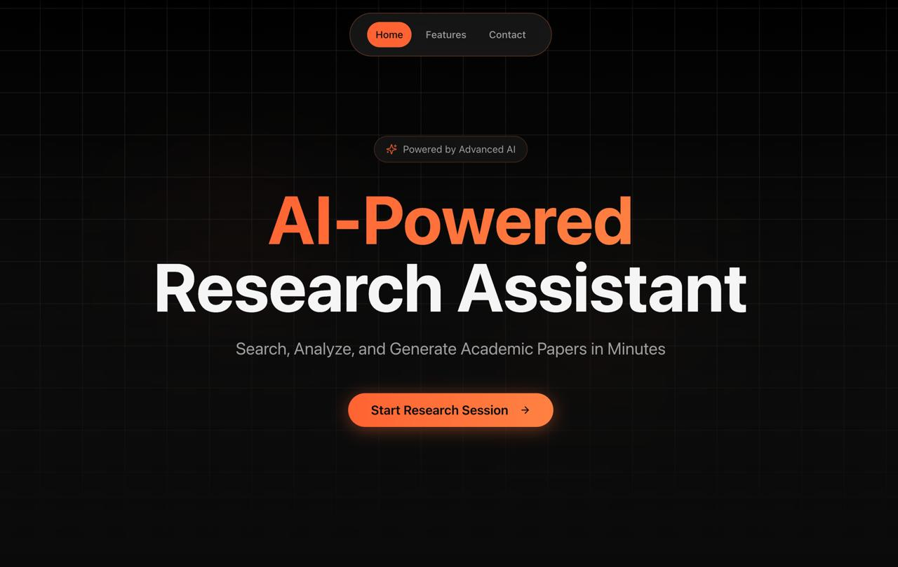
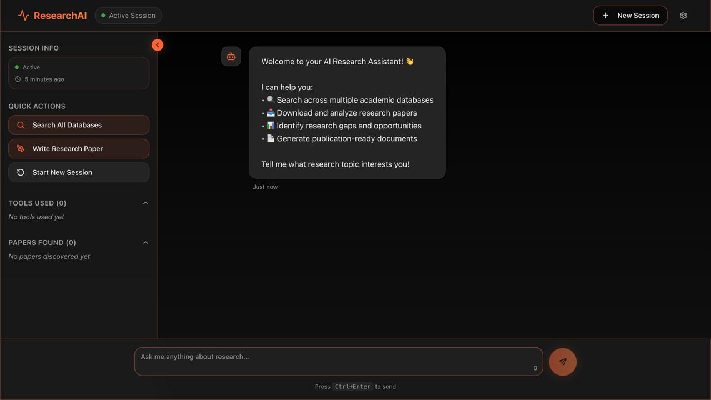
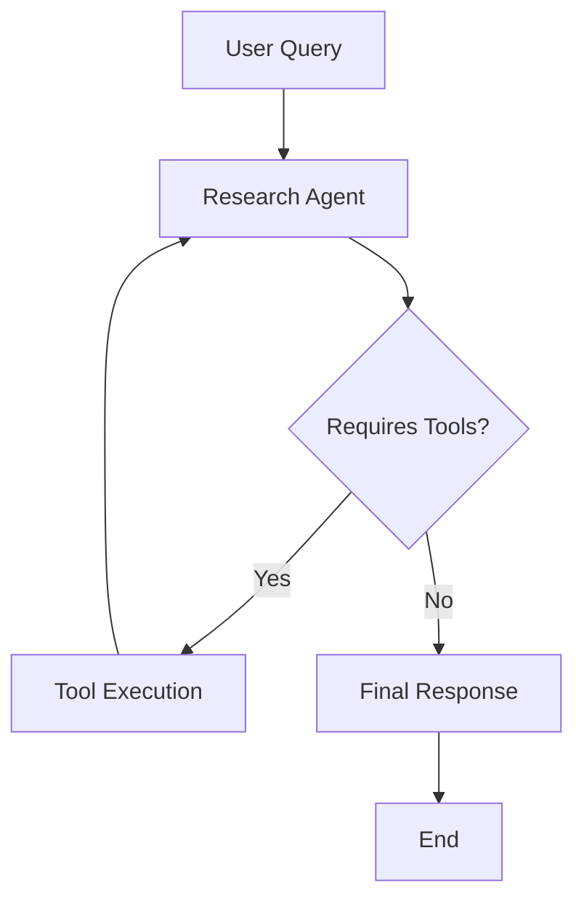

# Research AI Agent

An AI-powered academic research assistant built with LangGraph and LangChain. This system searches multiple academic databases, processes research papers, and provides intelligent research assistance.

## 🎯 Overview

The Research AI Agent is a comprehensive system that automates academic exploration across databases such as arXiv, PubMed, Semantic Scholar, and CrossRef. Beyond database search, it can intelligently search the web for relevant research on any topic, download and parse papers, and assist users in querying, summarizing, and analyzing complex research content.

It goes a step further — the agent can generate new research papers in authentic academic formatting and structure, synthesizing insights from multiple sources while maintaining coherence and originality.

With full frontend integration, the system offers an intuitive, visually engaging interface that enhances usability, making advanced research interactions feel fluid, intelligent, and beautifully designed.

## 🎨 Visual Interface

### Landing Page
The main landing page showcases the AI-powered research assistant with an elegant interface and animated grid background.



### Research Dashboard
The interactive dashboard provides real-time research capabilities, tool activity monitoring, and session management features.




## Features

✨ **Multi-Database Search**: Search across arXiv, PubMed, Semantic Scholar, and CrossRef simultaneously

📥 **Paper Download & Analysis**: Automatically download and extract information from research papers

🤖 **AI-Powered Research**: Intelligent agent that understands research workflows

📄 **LaTeX Paper Generation**: Create publication-ready research papers with proper formatting

💬 **Real-time Streaming**: Watch the AI work with live tool activity updates

🎯 **Quick Actions**: One-click access to common research tasks

📊 **Session Management**: Maintain research context across conversations

## 🏗️ Architecture

### LangGraph Workflow


**Research Agent**: Single-agent system that uses various academic search tools to gather information and process PDFs.

## 🛠️ Available Tools

### Academic Search Tools (LangChain)

#### Core Database Tools
- **`arxiv_search`** - Searches arXiv for recent papers on a topic, returns metadata including title, authors, summary, and PDF links
- **`pubmed_search`** - Searches PubMed for biomedical/life sciences papers, returns metadata including title, authors, summary, and PMID links
- **`semantic_scholar_search`** - Searches Semantic Scholar (AI/CS focused), returns paper metadata including citation counts, years, and PDF URLs
- **`crossref_search`** - Searches across multiple publishers via CrossRef, returns metadata including DOI, publisher, and subject categories

#### Multi-Database Tools
- **`multi_database_search`** - Simultaneously searches all academic databases (arXiv, PubMed, Semantic Scholar, CrossRef) and returns organized results by source
- **`download_papers_from_search`** - Searches specified databases and downloads available PDFs to local directories

#### PDF Processing Tools
- **`read_pdf`** - Extracts text content from PDF files
- **`read_pdf_with_metadata`** - Extracts text and metadata from PDF files
- **`render_latex_pdf`** - Generates PDF files from LaTeX content

## 🔄 Data Flow

```
User Input (Chat.tsx)
    ↓
API Service (api.ts)
    ↓
FastAPI Backend (api.py)
    ↓
LangGraph Agent (ai_researcher.py)
    ↓
Research Tools (research_tool.py, pdf_reader.py, pdf_writer.py)
    ↓
SSE Stream Response
    ↓
Frontend Updates (Real-time)
```

## 📊 API Endpoints Used

| Endpoint | Method | Purpose |
|----------|--------|---------|
| `/sessions` | POST | Create new research session |
| `/sessions/{id}` | GET | Get session status |
| `/sessions/{id}` | DELETE | Delete session |
| `/chat` | POST | Send message (non-streaming) |
| `/chat/stream` | POST | Send message (streaming) |
| `/quick-action` | POST | Execute quick action |
| `/pdf/{id}` | GET | Download PDF |
| `/health` | GET | Health check |


## 📦 Installation & Setup

### Prerequisites
- Python 3.8 or higher
- OpenAI API key
- Git

### 1. Git Initialization

```bash
# Initialize git repository (if not already done)
git init

# Add remote origin (replace with your repository URL)
git remote add origin <your-repository-url>

# Create .gitignore
cat > .gitignore << EOF
.env
__pycache__/
*.log
downloaded_papers/
research_papers/
venv/
.DS_Store
EOF

# Initial commit
git add .
git commit -m "Initial commit: Research AI Agent with multi-database search"
```

### 2. Environment Setup

```bash
# Create virtual environment
python -m venv venv
source venv/bin/activate  # On Windows: venv\Scripts\activate

# Install dependencies
pip install -r requirements.txt

# Create .env file
cat > .env << EOF
OPENAI_API_KEY=your_openai_api_key_here
EOF
```


## 🚀 Quick Start

See [QUICKSTART.md](./QUICKSTART.md) for a 3-step setup guide.

**TL;DR:**
```bash
# Terminal 1 - Start Backend
./start-backend.sh

# Terminal 2 - Start Frontend  
./start-frontend.sh

# Open http://localhost:8080/chat
```

**Edit a file directly in GitHub**

- Navigate to the desired file(s).
- Click the "Edit" button (pencil icon) at the top right of the file view.
- Make your changes and commit the changes.

**Use GitHub Codespaces**

- Navigate to the main page of your repository.
- Click on the "Code" button (green button) near the top right.
- Select the "Codespaces" tab.
- Click on "New codespace" to launch a new Codespace environment.
- Edit files directly within the Codespace and commit and push your changes once you're done.

## What technologies are used for this project?

### Frontend
- **Vite** - Fast build tool and dev server
- **TypeScript** - Type-safe JavaScript
- **React 18** - UI framework
- **shadcn/ui** - Beautiful component library
- **Tailwind CSS** - Utility-first CSS
- **TanStack Query** - Data fetching and caching
- **Lucide React** - Icon library

### Backend
- **FastAPI** - Modern Python web framework
- **LangGraph** - Agent orchestration framework
- **LangChain** - LLM application framework
- **OpenAI GPT-4** - Language model
- **Multiple APIs** - arXiv, PubMed, Semantic Scholar, CrossRef


## Documentation

- [QUICKSTART.md](./QUICKSTART.md) - Get started in 3 steps
- [INTEGRATION_GUIDE.md](./INTEGRATION_GUIDE.md) - Detailed integration documentation
- [research/README.md](./research/README.md) - Backend documentation

#
